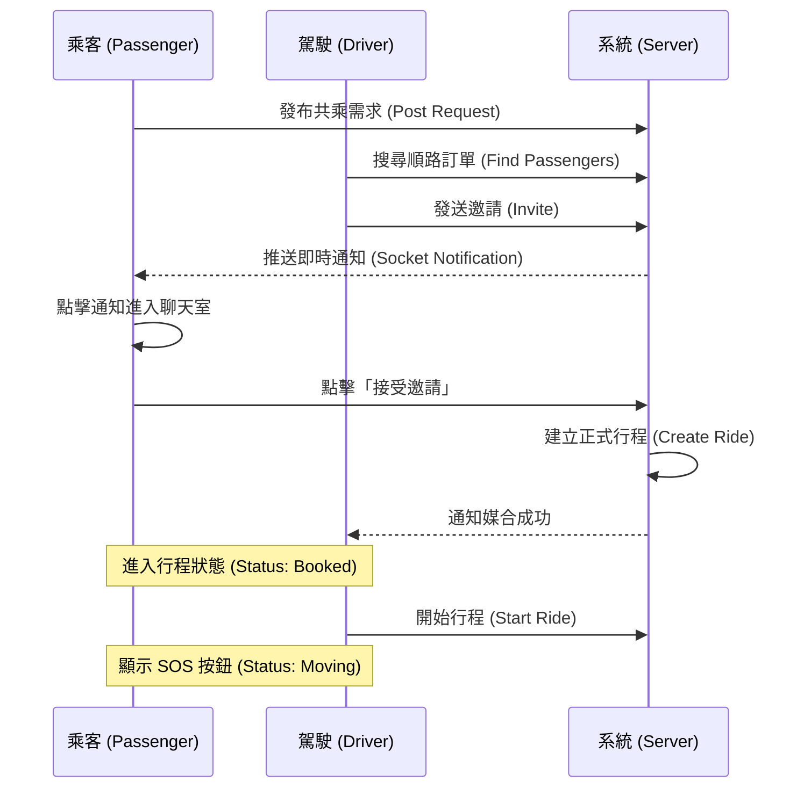

# Dot to Dot (SCU Connect) 系統設計白皮書

本文件旨在詳細闡述 **Dot to Dot** 校園共享服務平台的技術架構、核心邏輯與安全性設計。專案採用現代化全端架構，並針對校園場景導入「零知識支付」與「雙重安全防護」機制。

## 1. 系統概觀 (System Overview)
**Dot to Dot** 是專為東吳大學 (SCU) 場景打造的 P2P 共享服務平台，解決雙溪與城中校區的交通與物流痛點。
*   **核心價值**: 將校園內的閒置資源（如空車位、閒置人力）透過「順路」概念轉化為服務。
*   **關鍵服務**: 共乘 (Ride Sharing)、校園物流 (Campus Logistics)、跑腿團購 (Errands - 支援實報實銷機制)。

---

## 2. 系統架構設計 (System Architecture)

### 2.1 技術堆疊 (Tech Stack)
*   **Frontend**: React 18, Vite, Tailwind CSS (Mobile-First Design)
*   **Backend**: Node.js, Express (RESTful API)
*   **Database**: SQLite3 (Embedded Relational DB)
*   **Real-time Communication**: Socket.io (WebSocket Protocol)
*   **Security**: JWT Auth, Bcrypt Hashing, Zero-Knowledge Proof (Payment)

### 2.2 系統架構圖 (System Architecture Diagram)
系統採用前後端分離架構，透過 HTTP 與 WebSocket 協定並行溝通。

```mermaid
graph TD
    User[使用者 (Client)]
    subgraph Frontend [React SPA]
        UI[UI Components]
        SocketClient[Socket.io Client]
        LocalStore[LocalStorage (ZK Keys)]
    end
    
    subgraph Backend [Node.js Server]
        API[Express API Routes]
        SocketServer[Socket.io Server]
        Auth[JWT Middleware]
    end
    
    subgraph Database [SQLite]
        Users[Users Table]
        Rides[Rides Table]
        Chats[Chats Table]
    end

    User <--> UI
    UI <--> SocketClient
    UI -- HTTPS Requests --> API
    SocketClient -- WebSocket (Events) --> SocketServer
    
    API -- SQL Queries --> Database
    SocketServer -- Publish/Subscribe --> Frontend
    LocalStore -.->|Payment Data (P2P)| SocketClient
```

### 2.3 資料流向 (Data Flow)
1.  **REST API**: 處理 CRUD 操作（發布需求、搜尋訂單、評價），確保資料一致性。
2.  **Socket.io**: 處理即時互動（邀請通知、聊天訊息、狀態更新），降低伺服器輪詢負擔。

---

## 3. 核心功能與實作邏輯 (Core Features)

### 3.1 身份驗證與權限 (Auth & Permissions)
*   **JWT 機制**: 登入後發放 Token，後端 Middleware 驗證 `Authorization` Header。
*   **校園黑名單 (Community Watch)**:
    *   **觸發**: 用戶累積 3 次嚴重違規檢舉 (`report_count >= 3`)。
    *   **執行**: 系統自動將 `is_banned` 設為 `true`，並拒絕該學號登入。

### 3.2 共乘媒合引擎 (Ride Matching Engine)
採用「雙向選擇」機制，由駕駛發起邀請，乘客確認後才建立訂單。

**使用者互動流程 (User Flow)**:



### 3.3 即時通訊中樞 (Chat Hub)
*   **統一介面**: 所有服務 (Ride/Logistics/Food) 共用 `ChatRoom.jsx`，透過 `contextType` 區分邏輯。
*   **邀請卡 (Invitation Card)**: 特殊訊息類型，前端解析 JSON 渲染為互動按鈕，而非純文字。

### 3.4 零知識支付機制 (Privacy-First Payment)
我們重視隱私，平台永遠不儲存使用者的敏感金流資料。
1.  **輸入**: 用戶在前端輸入銀行帳號/街口代碼。
2.  **加密**: 資料僅儲存於用戶端瀏覽器的 `LocalStorage`。
3.  **傳輸**:
    *   駕駛點擊「發送收款資訊」。
    *   資料透過 Socket 通道點對點傳輸 (P2P-like)。
    *   伺服器僅做轉發 (Relay)，不落地存儲 (`No Persistence`)。
4.  **銷毀**: 接收端閱後即焚，對話記錄表中不存有該資訊。

### 3.5 跑腿實報實銷 (Actual Cost Update)
針對跑腿與許願服務，解決預估價格與實際發票金額不符的痛點。
*   **機制**: 跑腿者購買後，可於訂單管理輸入「實際發票金額」。
*   **即時推播**: 系統透過 Socket 即時推播更新後的金額給委託者，雙方確認後再進行支付，避免價差爭議。

---

## 4. 資料庫設計 (Database Schema)

| Table | Key Columns | Description |
| :--- | :--- | :--- |
| **users** | `id`, `email`, `password`, `is_banned` | 用戶核心資料與安全狀態 |
| **rides** | `id`, `driver_id`, `passenger_id`, `status` | 正式成立的共乘訂單 |
| **ride_requests** | `id`, `origin`, `destination`, `budget` | 乘客發布的原始需求池 |
| **deliveries** | `id`, `requester_id`, `provider_id` | 物流與搬運訂單 |
| **chats** | `related_id`, `type`, `content` | 各類型服務的對話記錄 |
| **notifications** | `user_id`, `type`, `is_read` | 系統通知歷史 |

---

## 5. API 介面規格摘要 (API Specification)

後端提供完整的 RESTful API，以下列舉核心介面 (請依據實際 `server/index.js` 為準)：

### Auth
*   `POST /api/register`: 註冊新用戶 (含學號檢查)。
*   `POST /api/login`: 登入並回傳 Token (含停權檢查)。

### Rides
*   `GET /api/ride-requests`: 駕駛搜尋乘客需求 (Status='open')。
*   `GET /api/rides`: 搜尋已建立的順路行程。
*   `POST /api/ride-requests/:id/invite`: 發送共乘邀請 (觸發 Socket 通知)。
*   `POST /api/rides`: 建立共乘訂單。
*   `GET /api/rides/:id`: 獲取單筆行程詳情。
*   `PUT /api/rides/:id/accept`: 乘客接受邀請。

### Reports
*   `POST /api/report`: 提交違規檢舉 (觸發自動封鎖邏輯)。

---

## 6. 安全性與防護機制 (Safety & Protection)

### 6.1 SOS 緊急報案 (Direct 110 SOS)
*   **觸發時機**: 僅在訂單狀態為 `moving` (行駛中) 時顯示。
*   **機制**: 前端強制喚起 `tel:110` 協議，跳過簡訊與第三方 API，提供最直接的警方連線與位置鎖定 (透過電信三角定位)。
*   **嚇阻力**: 明顯的 UI 警告與撥號動作用於第一時間嚇阻潛在加害者。

### 6.2 系統穩定性 (Stability)
*   **斷線重連**: Socket.io Client 配置 `reconnection: true`，網路波動時自動重連。
*   **狀態鎖定**: 資料庫使用 Transaction 或狀態檢查 (`WHERE status = 'open'`) 防止多位駕駛搶接同一單 (Race Condition)。

---

## 7. 專案迭代與未來展望 (Roadmap)

### 已完成 (Done)
- [x] 核心共乘與物流媒合系統。
- [x] 即時聊天與通知中樞。
- [x] 零知識支付資料傳輸。
- [x] SOS 安全報案與黑名單機制。

### 待開發 (Future)
- [ ] **AI 智能順路演算法**: 引入 Google Maps API 計算路線重疊率，自動推薦最佳乘客。
- [ ] **PWA 支援**: 支援離線瀏覽與手機桌面安裝。
- [ ] **跨校區聯盟**: 開放鄰近學校 (如銘傳、文化) 學生註冊，擴大共乘生活圈。

---
*Document Version: 2.0 | Last Updated: 2025-12-10*
