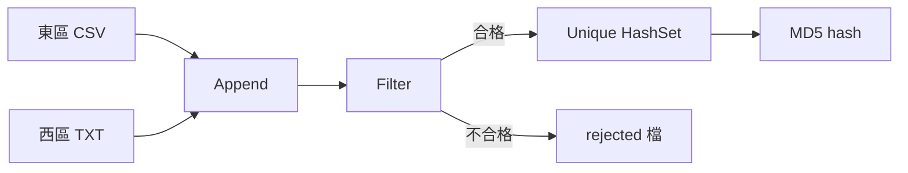
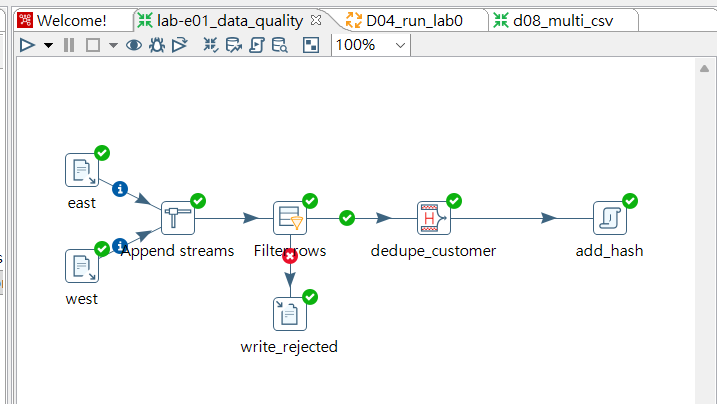
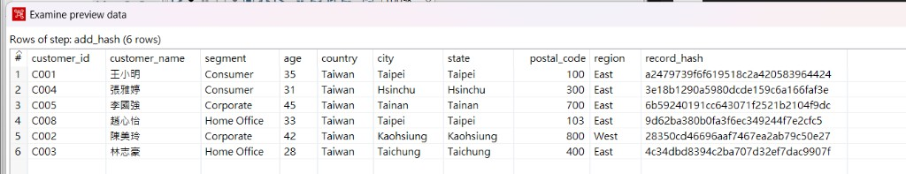
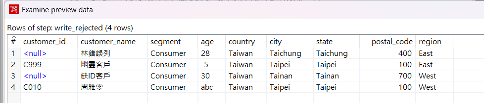

# Pentaho ETL — 多來源客戶資料品質閘門

Pentaho Data Integration（PDI）實作：合併兩區客戶檔、驗證資料品質、去重，並產出稽核用 hash。

**技術棧：** Pentaho Spoon 9.3 CE · Java

---

## 流程結果

| 步驟 | 結果 |
|------|------|
| 合併東區 CSV + 西區 pipe 檔 | 13 筆 |
| 品質篩選（空 ID、非法 age） | 4 筆 rejected |
| 依 `customer_id` 去重 | 6 筆合格 |
| MD5 `record_hash` | 每筆資料的稽核指紋 |

---

## 資料流



### 畫布（Spoon）



### 輸出 — 6 筆合格資料 + record_hash



### Rejected — 4 筆（空 ID、非法 age）



---

## 目錄結構

```
e1-data-quality/
├── artifacts/lab-e01_data_quality.ktr   # transformation
├── artifacts/rejected_sample.txt        # rejected 輸出範例
├── screenshots/                         # Spoon 執行截圖
└── sample-data/                         # 測試用髒資料
```

---

## 技術重點

- **Append 前對齊 schema**（`age` 設為 String，因含非數字髒值）
- **Filter**：`IS NOT NULL`、空字串檢查、`REGEXP` 驗證 age 為數字
- **Unique rows (HashSet)**：不需先 Sort 即可依 key 去重
- **Rejected 檔**：不合格資料另存，方便追溯

---

## 本機執行

1. 安裝 [Pentaho PDI](https://github.com/pentaho/pentaho-kettle) + Java
2. 用 Spoon 開啟 `artifacts/lab-e01_data_quality.ktr`
3. 將 east / west 路徑改為你本機的 `sample-data/` 位置
4. 執行後對照 `artifacts/rejected_sample.txt`

---

## 涵蓋技能

ETL · 資料品質 · 多格式讀取 · 去重 · 稽核紀錄
