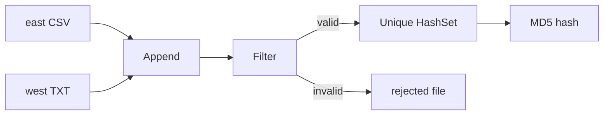

# Pentaho ETL — Multi-Source Customer Data Quality Gate

Pentaho Data Integration (PDI) lab: merge customer files from two regions, validate records, deduplicate, and output an audit hash.

**Stack:** Pentaho Spoon 9.3 CE · Java

---

## What it does

| Step | Result |
|------|--------|
| Merge east (CSV) + west (pipe-delimited) | 13 rows |
| Quality filter (null ID, invalid age) | 4 rejected |
| Deduplicate by `customer_id` | 6 clean rows |
| MD5 `record_hash` | audit fingerprint per row |

---

## Pipeline



### Workflow (Spoon)


### Output — 6 clean rows with MD5 hash


### Rejected — 4 rows (null ID, invalid age)


---

## Repo layout

```
e1-data-quality/
├── artifacts/lab-e01_data_quality.ktr   # transformation
├── artifacts/rejected_sample.txt        # sample rejected output
├── screenshots/                         # Spoon run screenshots
└── sample-data/                         # dirty test files
```

---

## Highlights

- **Schema alignment** before append (`age` as String for mixed dirty values)
- **Filter** with `IS NOT NULL`, empty check, and `REGEXP` for numeric age
- **Unique rows (HashSet)** for dedup without a separate sort step
- **Rejected records** written to a file for traceability

---

## Run locally

1. Install [Pentaho PDI](https://github.com/pentaho/pentaho-kettle) + Java
2. Open `artifacts/lab-e01_data_quality.ktr` in Spoon
3. Point east/west inputs to `sample-data/` paths on your machine
4. Run and compare output with `artifacts/rejected_sample.txt`

---

## Skills demonstrated

ETL · data quality · multi-format ingest · deduplication · audit logging
