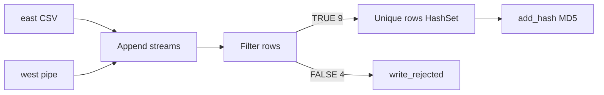

# Lab E1 — 土銀客戶主檔品質閘門（Pentaho PDI）

> **歐立威 SI 模擬場景：** 東區 CSV + 西區 pipe 客戶主檔合併，品質不合格列寫入 rejected 檔，合格列去重後加 MD5 稽核 hash。  
> **工具：** Pentaho Data Integration (Spoon) 9.3 CE · PostgreSQL 16（E3 後使用）

---

## 成果一覽

| 指標 | 數字 | 說明 |
|------|------|------|
| read | **13** | east 7 + west 6 |
| rejected | **4** | 空 ID ×2、age=-5、age=abc |
| written | **6** | 去重後合格客戶 |
| 品質規則 | 3 條 | 非空 ID、age 整數、age ≥ 0（REGEXP） |

---

## 資料流



---

## 目錄結構

```
e1-data-quality/
├── README.md                          ← 本文件
├── artifacts/
│   ├── lab-e01_data_quality.ktr       ← Pentaho transformation
│   └── rejected_sample.txt            ← rejected 輸出範例（4 列）
├── sample-data/
│   ├── east/customers_dirty_east.csv
│   └── west/customers_dirty_west.txt
└── screenshots/
    ├── README.md                      ← 截圖命名說明
    ├── 01-workflow.png                ← （請自行放入）
    ├── 02-output-6-rows.png
    └── 03-rejected-4-rows.png
```

完整課程路徑：`ETL ENGINEER/pentaho-course/transformations/lab-e01_data_quality.ktr`

---

## 關鍵技術決策

### 1. Append 前統一型別

dirty 資料含 `abc`、`-5`，**east / west 的 `age` 都設為 String**，否則 Append 報 Integer vs String 錯誤。

### 2. Filter 分流

```
customer_id IS NOT NULL
AND customer_id <> ''
AND age REGEXP ^[0-9]+$
```

從 Filter 拉線時：

- 合格路 → **Result is TRUE**（綠勾）
- rejected → **Result is FALSE**（紅 X，正常）

### 3. 去重用 Unique rows (HashSet)

一般 **Unique rows** 只吃**連續相鄰**重複，須先 Sort。  
**HashSet 版**不需排序，依 `customer_id` 去重：9 → 6。

### 4. record_hash（稽核指紋）

**User Defined Java Expression：**

```java
org.apache.commons.codec.digest.DigestUtils.md5Hex(
  customer_id + "|" + customer_name + "|" + segment
)
```

---

## rejected 4 列對照

| customer_id | customer_name | 原因 |
|-------------|---------------|------|
| （空） | 林錯誤列 | 缺 business key |
| C999 | 幽靈客戶 | age = -5 |
| （空） | 缺ID客戶 | 缺 business key |
| C010 | 周雅雯 | age = abc |

---

## 本機重現

1. 安裝 [Pentaho PDI CE 9.3](https://github.com/pentaho/pentaho-kettle) + Java
2. 開啟 `artifacts/lab-e01_data_quality.ktr`
3. 將 **east / west** 的檔案路徑改為你本機的 `sample-data/` 路徑
4. Run → 檢查 `artifacts/rejected_sample.txt` 格式與列數

---

## 面試 30 秒

> 模擬土銀客戶主檔導入：東西兩區 Append 13 筆，Filter 把 4 筆不合約寫 rejected 留證據，合格 9 筆用 HashSet 依 customer_id 去重得 6 筆，再加 MD5 record_hash。我在 VD ETL 也做過異常值分流，邏輯相同，只是 Pentaho 用 Filter + HashSet 實作。

---

## 對應歐立威 JD

| JD | 本 Lab |
|----|--------|
| ETL 抽取轉換載入、確保正確性 | Filter 品質閘門 + rejected 檔 |
| 資料正確性 / 稽核 | read / written / rejected 可交代 |
| 金融客戶治理 | 每列有去向，不合約不進 ODS |

---

**下一步：** [Lab E2 增量載入](../../pentaho-course/03-lab-enterprise-challenges.md#lab-e2--台電負載銷售增量批次-)
