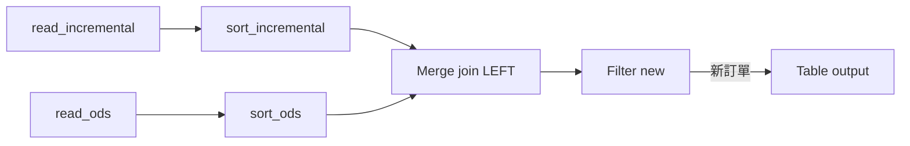
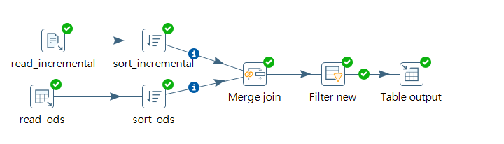
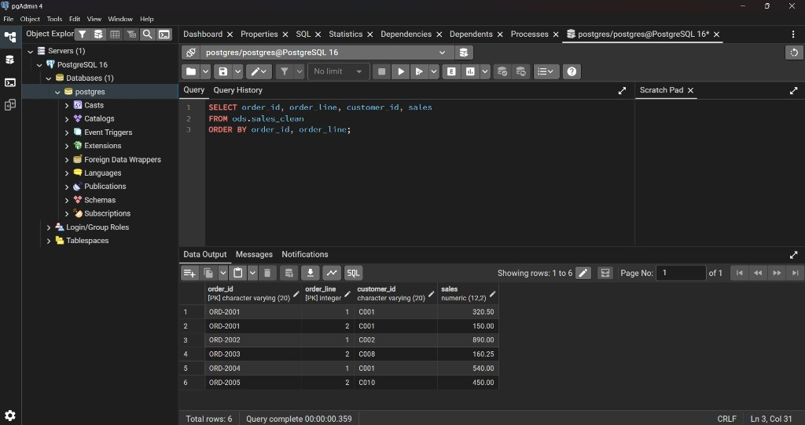

# Pentaho ETL — 銷售增量載入（CSV → PostgreSQL ODS）

Pentaho Data Integration（PDI）實作：讀取增量銷售 CSV，與 ODS 已有資料比對，只 INSERT 新訂單；同一批檔案重跑不會重複寫入。

**技術棧：** Pentaho Spoon 9.3 CE · Java 11 · PostgreSQL 16

---

## 流程結果

| 步驟 | 結果 |
|------|------|
| 讀 3 個增量 CSV | 6 筆 |
| Merge Join（LEFT）比對 `ods.sales_clean` | 第一次右表全 null；第二次 6 筆全對到 |
| Filter `order_id_1 IS NULL` | 第一次 6 筆通過；第二次 0 筆 |
| Table output → `ods.sales_clean` | 第一次寫入 6；重跑寫入 0 |
| `SELECT COUNT(*) FROM ods.sales_clean` | 維持 **6**（冪等） |

業務 key：`order_id` + `order_line`（表上 `PRIMARY KEY`）

---

## 資料流



### 畫布（Spoon）



### ODS 驗證 — 6 筆寫入 `ods.sales_clean`



---

## 目錄結構

```
e2-incremental-sales/
├── artifacts/lab-e02_incremental_sales.ktr   # transformation
└── screenshots/                              # Spoon 畫布 + pgAdmin 驗證
```

---

## 技術重點

- **雙路 Sort**：Merge Join 前，`sort_incremental` 與 `sort_ods` 皆依 `order_id`、`order_line` 排序
- **Merge Join**（LEFT OUTER）：
  - Step 1 = `sort_incremental`（增量）
  - Step 2 = `sort_ods`（ODS 已有）
  - Keys：`order_id`、`order_line`
- **Filter new**（TRUE → Table output）：

```
order_id_1 IS NULL
```

  右表 key 為 null 代表 ODS 尚無此訂單，才往下寫入。

- **Table output**：目標 `ods.sales_clean`，只 map 7 欄（不含 CSV 的 `ship_date`、`ship_mode`、`discount`、`profit`）：

| 資料庫欄位 | 資料流欄位 |
|-----------|-----------|
| order_line | order_line |
| order_id | order_id |
| customer_id | customer_id |
| product_id | product_id |
| order_date | order_date |
| sales | sales |
| quantity | quantity |

- **Truncate table**：不勾選（避免每次全量清空）

---

## 本機執行

1. PostgreSQL 建立 schema／表（見 `pentaho-course/sample-data/dwh/setup_postgresql.sql`）
2. 用 **Java 11** 啟動 Spoon（PDI 9.3 與 Java 25 JDBC 不相容）
3. 開啟 `artifacts/lab-e02_incremental_sales.ktr`
4. 將 `read_incremental` 的 CSV 路徑、`postgres_local` 連線改為本機設定
5. 第一次 Run → pgAdmin 確認 `COUNT(*) = 6`；再 Run 一次 → 仍為 6

驗證 SQL：

```sql
SELECT COUNT(*) FROM ods.sales_clean;

SELECT order_id, order_line, customer_id, sales
FROM ods.sales_clean
ORDER BY order_id, order_line;
```

---

## 涵蓋技能

ETL · 增量載入 · Sort / Merge Join · PostgreSQL ODS · 冪等批次
