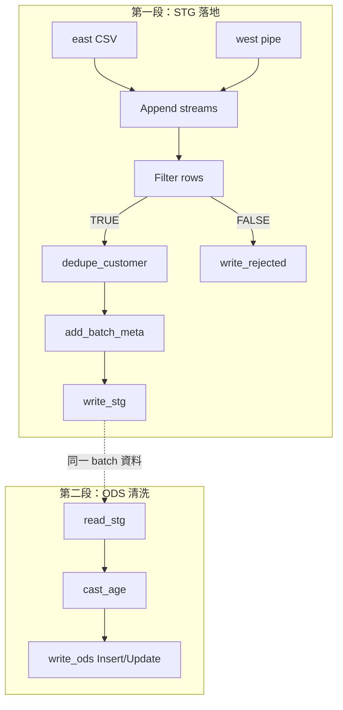
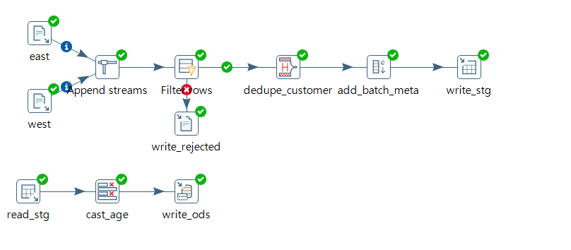
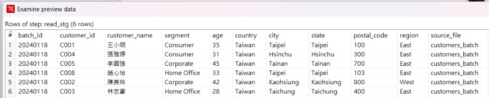
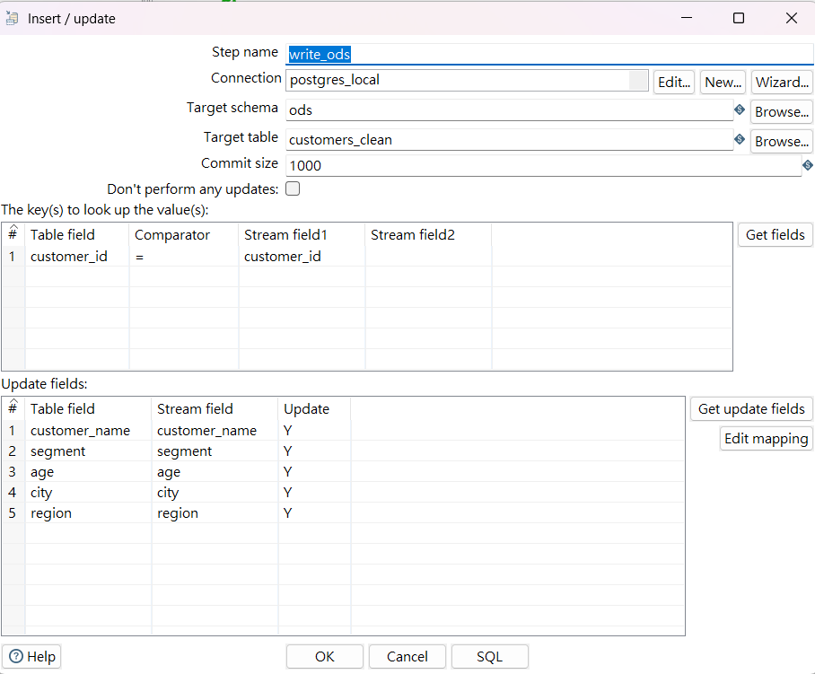
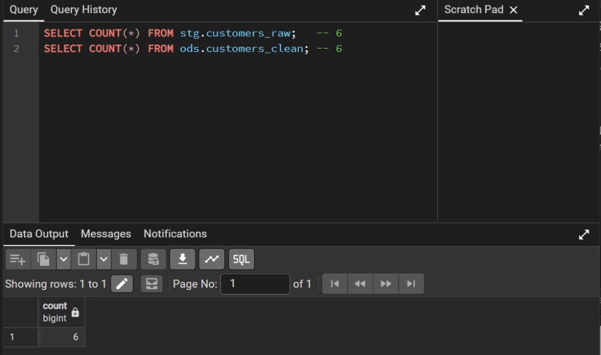
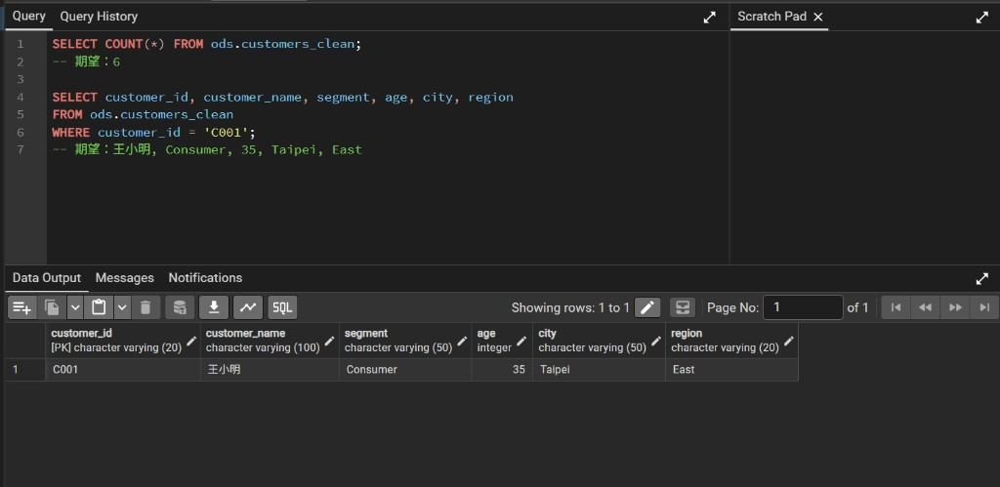

# Pentaho ETL — STG → ODS 分層導入（客戶主檔）

Pentaho Data Integration（PDI）實作：承接 E1 客戶品質閘門，先將清洗後資料帶 `batch_id` 落地 **STG**（稽核留證），再從 STG 讀回、轉型後 **Upsert** 至 **ODS**（下游可信來源）。

**技術棧：** Pentaho Spoon 9.3 CE · Java 11 · PostgreSQL 16

---

## 流程結果

| 段 | 步驟 | 結果 |
|----|------|------|
| 清洗（承接 E1） | east + west → Append → Filter → dedupe | 13 讀取 → 9 合格 → **6** 去重 |
| STG 落地 | add_batch_meta → write_stg | **6** 筆寫入 `stg.customers_raw` |
| ODS 清洗 | read_stg → cast_age → write_ods | **6** 筆 Upsert `ods.customers_clean` |
| SQL 驗收 | `COUNT(*)` | STG = **6**，ODS = **6** |
| C001 抽查 | 王小明, Consumer, age=35 | 與預期一致 |

業務 key：`customer_id`（ODS `PRIMARY KEY`）

---

## 資料流



### 畫布（Spoon）— 兩段流程



### STG 讀回 — `read_stg` Preview 6 列



### ODS Upsert 設定 — `write_ods`（Insert / Update）

Key = `customer_id`；Update = `customer_name`, `segment`, `age`, `city`, `region`



### pgAdmin 驗收 — STG / ODS COUNT = 6



### C001 明細驗證



---

## 目錄結構

```
e3-stg-to-ods/
├── artifacts/lab-e03_stg_to_ods.ktr
└── screenshots/
    ├── 01-workflow.png
    ├── 02-stg-ods-count.png
    ├── 03-ods-c001-verify.png
    ├── 04-read-stg-preview.png
    └── 05-insert-update-ods.png
```

---

## 技術重點

### 第一段：檔案 → STG

- **承接 E1**：Filter（TRUE 合格 / FALSE rejected）、Unique rows (HashSet) 依 `customer_id` 去重
- **編碼**：east / west 皆設 **UTF-8**；west 分隔符 `|`
- **Append 前 schema 對齊**：`age`、`postal_code` 皆為 **String**
- **add_batch_meta**：`batch_id = 20240118`、`source_file = customers_batch`
- **write_stg** → `stg.customers_raw`：第一次 **Truncate**；map 11 欄（不含 `loaded_at`，DB 預設 `NOW()`）

### 第二段：STG → ODS

- **read_stg**（Table input）：

```sql
SELECT batch_id, customer_id, customer_name, segment, age,
       country, city, state, postal_code, region, source_file
FROM stg.customers_raw
WHERE batch_id = '20240118'
```

- **cast_age**（Select values）：`age` String → **Integer**
- **write_ods**（**Insert / Update**，非 Table output）：
  - Key：`customer_id`
  - Update：`customer_name`, `segment`, `age`, `city`, `region`
  - 重跑安全：有則 UPDATE，無則 INSERT（避免 duplicate key）

### 並行執行注意

同一 `.ktr` 內兩段流程**平行跑**時，`read_stg` 可能早於 `write_stg` 讀到上一輪殘留資料。實務上可：

- 同一 transformation **Run 兩次**（第二輪 STG 已完整）；或
- 拆成 **Job** 兩段依序執行

---

## 驗收 SQL

```sql
SELECT COUNT(*) FROM stg.customers_raw;   -- 期望 6
SELECT COUNT(*) FROM ods.customers_clean; -- 期望 6

SELECT customer_id, customer_name, segment, age, city, region
FROM ods.customers_clean
WHERE customer_id = 'C001';
-- 期望：王小明, Consumer, 35, Taipei, East
```

---

## 本機執行

1. 執行 `pentaho-course/sample-data/dwh/setup_postgresql.sql` 建表
2. 用 **Java 11** 啟動 Spoon（`Spoon-java11.bat`）
3. 開啟 `artifacts/lab-e03_stg_to_ods.ktr`
4. 調整 east / west 檔案路徑與 `postgres_local` 連線
5. Run → 確認 STG / ODS `COUNT(*)` 皆為 6

---

## 涵蓋技能

ETL · STG/ODS 分層 · batch_id · 型別轉換 · Insert/Update Upsert · PostgreSQL · 資料治理留證
