# Pentaho ETL — SCD Type 2 客戶維度（土銀 DWH）

Pentaho Data Integration（PDI）手動 SCD2 實作：比對 incoming 與現況維度，**關閉舊列**（`effective_to` / `is_current`）並 **Insert 新版**，保留 C001 Consumer 歷史供報表對帳。

**技術棧：** Pentaho Spoon 9.3 CE · Java 11 · PostgreSQL 16

---

## 流程結果

| 段 | 步驟 | 結果 |
|----|------|------|
| Seed | `write_seed` | **3** 列載入（C001, C002, C004） |
| 比對 | `read_dim_current` | **3** current |
| 變更偵測 | `filter_changed` | **1**（C001 segment 變更） |
| 關閉舊列 | `update_dim` | **U=1**（C001 Consumer → N） |
| 新客 | `filter_new` → `insert_new` | **1**（C008） |
| 變更新版 | `insert_changed` | **1**（C001 Corporate） |
| SQL | C001 歷史列數 | **2** |
| SQL | `is_current='Y'` | **4** |
| SQL | 全表總列數 | **5** |

業務 key：`customer_id` · 代理 key：`customer_sk`（SERIAL）

---

## 資料流

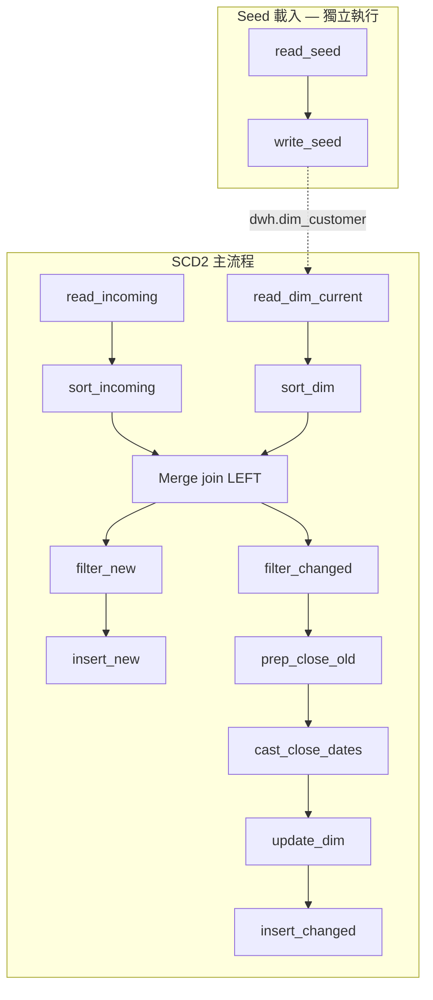

### 畫布（Spoon）

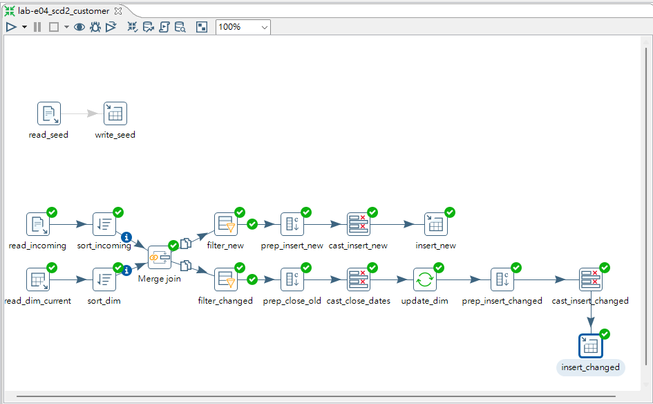

### Merge join — LEFT OUTER on `customer_id`

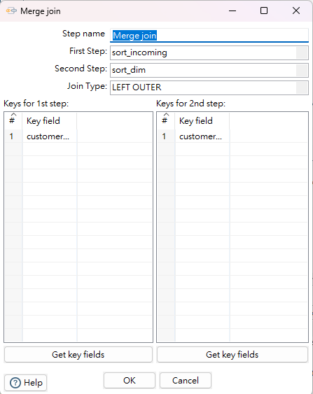

### filter_changed — segment 有變且已存在於維度

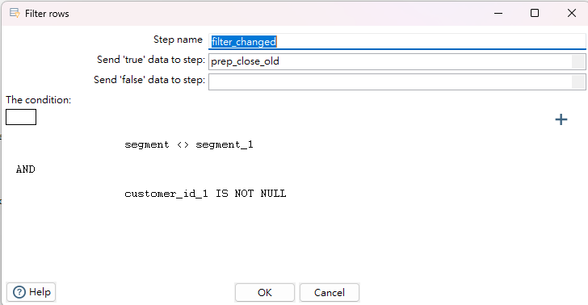

### update_dim — 以 `customer_sk` 關閉舊列

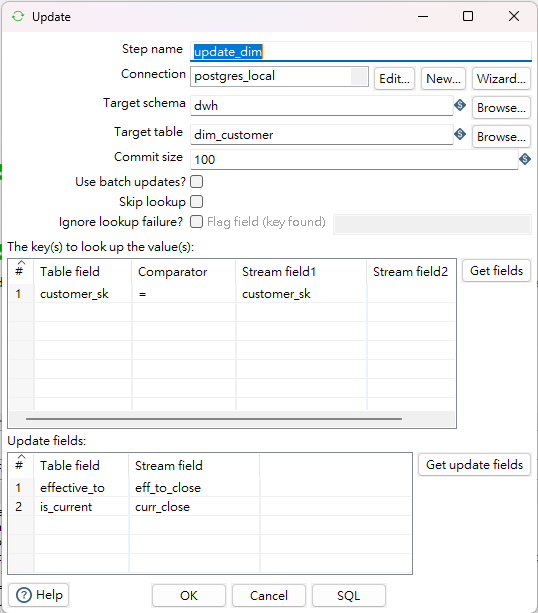

### insert_changed — 新列寫入（`insert_new` 設定相同）

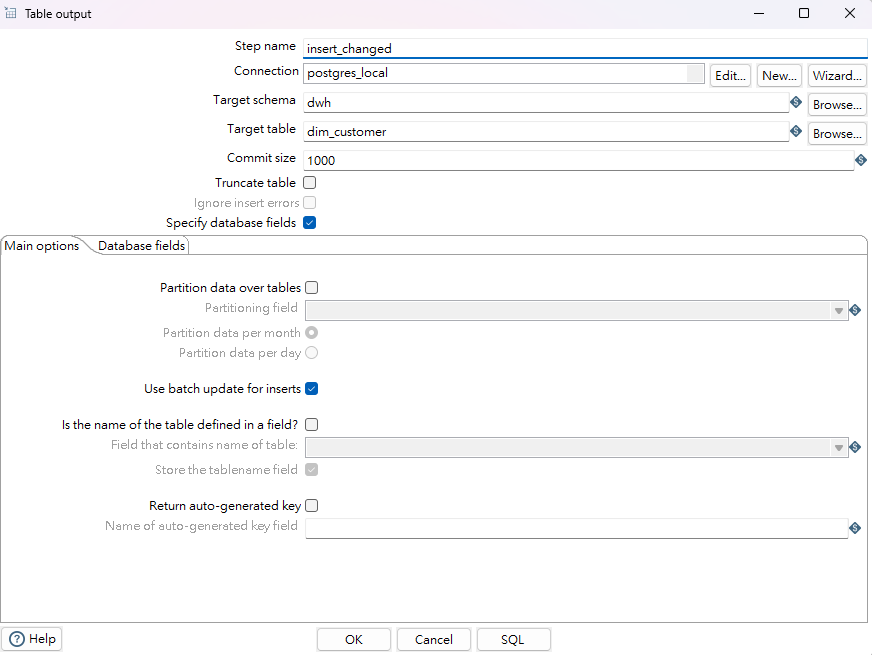

### read_incoming Preview — 3 筆今日變更

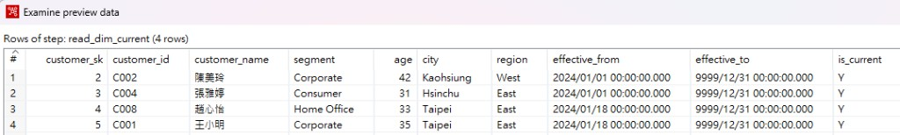

### pgAdmin — C001 兩筆歷史

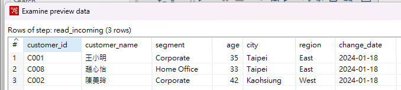

### pgAdmin — current 列 = 4

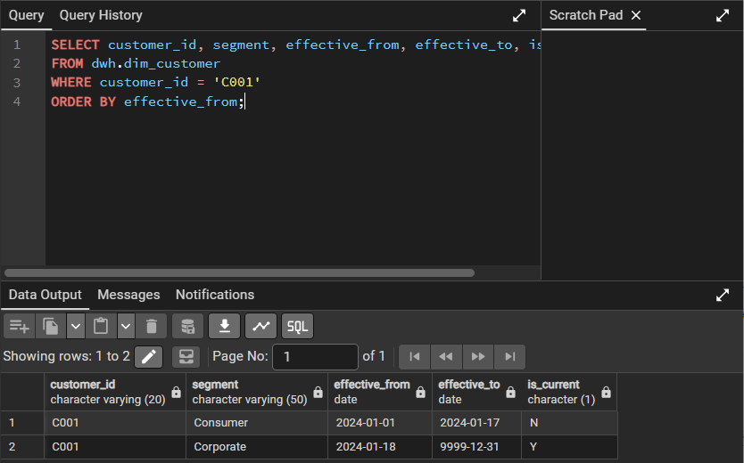

### pgAdmin — 全表 5 列

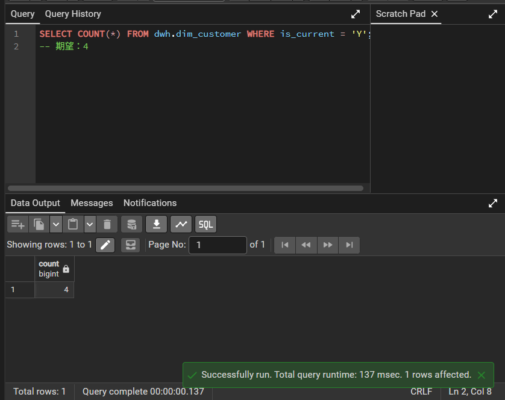

### pgAdmin — C002 未變更（仍 1 列）

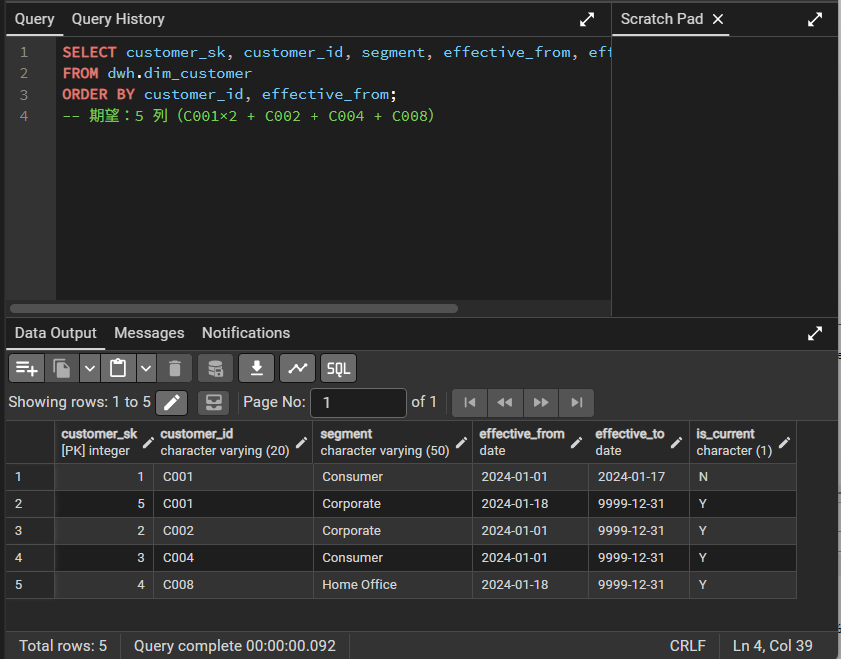

---

## 執行 Log（完整重跑，2026/07/08）

```
read_dim_current.0   W=3      ← 讀到 3 筆 current（seed 後）
filter_changed.0     W=1      ← C001：Consumer → Corporate
update_dim.0         U=1      ← 關閉 C001 舊列（effective_to=2024-01-17, is_current=N）
filter_new.0         W=1      ← C008 新客（customer_id_1 IS NULL）
insert_new.0         W=1      ← 寫入 C008
insert_changed.0     W=1      ← 寫入 C001 Corporate 新版
```

**解讀：**

- `read_dim_current W=3`：維度起點正確（C001/C002/C004 皆 current）。
- `filter_changed W=1` + `filter_new W=1`：Merge join 後正確分流；C002 segment 未變，兩個 filter 都不收。
- `update_dim U=1`：只更新舊列的 `effective_to`、`is_current`，不動其他欄位。
- `insert_new` / `insert_changed` 各 W=1：兩條 insert 路徑分開寫同一張表，避免欄位數不一致（19 vs 21）的合併錯誤。
- 全表結果：5 列總計、4 列 current（C002, C004, C008, C001 新版）。

---

## 技術重點

### read_dim_current（Table input）

```sql
SELECT
  customer_sk,
  customer_id,
  customer_name,
  segment,
  age,
  city,
  region,
  effective_from,
  effective_to,
  is_current
FROM dwh.dim_customer
WHERE is_current = 'Y';
```

只讀 **現行版** 維度列，作為 Merge join 右側比對基準。

### 表結構 DDL

> README 裡的 `...` 是「省略說明」佔位符，**不能貼進 pgAdmin 執行**。請用下方完整語句（或 `setup_postgresql.sql`）。

```sql
CREATE TABLE dwh.dim_customer (
    customer_sk     SERIAL PRIMARY KEY,
    customer_id     VARCHAR(20) NOT NULL,
    customer_name   VARCHAR(100),
    segment         VARCHAR(50),
    age             INT,
    city            VARCHAR(50),
    region          VARCHAR(20),
    effective_from  DATE NOT NULL,
    effective_to    DATE NOT NULL DEFAULT '9999-12-31',
    is_current      CHAR(1) NOT NULL DEFAULT 'Y'
);
```

### SCD2 日期規則

| 情境 | effective_from | effective_to | is_current |
|------|----------------|--------------|------------|
| Seed 初始列 | CSV `effective_from` | `9999-12-31` | `Y` |
| 關閉舊列 | 不變 | incoming `change_date` 前一天（`eff_to_close`） | `N` |
| 插入新版 | incoming `change_date` | `9999-12-31`（`eff_to_ins`） | `Y` |

### insert 欄位對應（`insert_new` / `insert_changed` 相同）

| Table field | Stream field |
|-------------|--------------|
| customer_id | customer_id |
| customer_name | customer_name |
| segment | segment |
| age | age |
| city | city |
| region | region |
| effective_from | change_date |
| effective_to | eff_to_ins |
| is_current | is_curr_ins |

不 map `customer_sk`，由 SERIAL 自動產生。

### 實作踩坑

1. **兩條 insert 路不能合併一個 Table output** — changed 路多 `eff_to_close`/`curr_close`，欄位 21 vs 19。
2. **seed 不要寫死 `customer_sk`** — 手動指定會讓 SERIAL 序號卡住，Insert 時 duplicate key。
3. **seed 與 SCD 分開跑** — Disable 其他 hop，只留 `read_seed → write_seed` 再 F9。
4. **`eff_to_close` 用 String + Select values 轉 Date** — Add constants 直接設 Date 易 parse 失敗。
5. **平行分支可能需 Run 兩次** — 若 `read_dim_current W=0`，再 F9 一次。

---

## 驗收 SQL

```sql
-- C001 應有 2 筆歷史
SELECT customer_id, segment, effective_from, effective_to, is_current
FROM dwh.dim_customer
WHERE customer_id = 'C001'
ORDER BY effective_from;

-- current 列應為 4
SELECT COUNT(*) FROM dwh.dim_customer WHERE is_current = 'Y';

-- 全表 5 列
SELECT customer_sk, customer_id, segment, effective_from, effective_to, is_current
FROM dwh.dim_customer
ORDER BY customer_id, effective_from;

-- C002 未變更，仍 1 列
SELECT customer_id, segment, is_current, COUNT(*)
FROM dwh.dim_customer
WHERE customer_id = 'C002'
GROUP BY 1, 2, 3;
```

| 查詢 | 預期 |
|------|------|
| C001 列數 | **2**（Consumer N + Corporate Y） |
| `is_current='Y'` | **4** |
| 全表 | **5** |
| C002 | **1** 列，Corporate，Y |

---

## 目錄結構

```
e4-scd2-customer/
├── README.md
├── artifacts/lab-e04_scd2_customer.ktr
└── screenshots/
    ├── 01-workflow.png
    ├── 02-merge-join.png
    ├── 03-filter-changed.png
    ├── 04-update-dim.png
    ├── 05-insert-dim.png
    ├── 06-c001-history.png
    ├── 07-current-count.png
    ├── 08-full-table.png
    ├── 09-c002-unchanged.png
    └── 10-incoming-preview.png
```

---

## 本機執行

1. 執行 `pentaho-course/sample-data/dwh/setup_postgresql.sql` 建表
2. 用 **Java 11** 啟動 Spoon（`Spoon-java11.bat`）
3. 開啟 `artifacts/lab-e04_scd2_customer.ktr`
4. **Seed**：`TRUNCATE dwh.dim_customer RESTART IDENTITY CASCADE;` → 只啟用 `read_seed→write_seed` hop → F9
5. Disable seed hop，啟用 SCD hop → F9（必要時跑第二次）
6. 跑上方驗收 SQL

---

## 涵蓋技能

ETL · SCD Type 2 · Merge Join · Filter rows · Update / Table output · PostgreSQL SERIAL · 維度歷史保留 · 金融報表對帳
