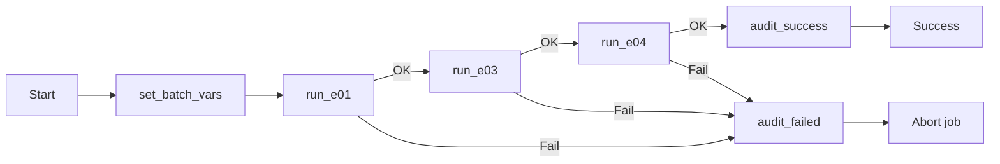
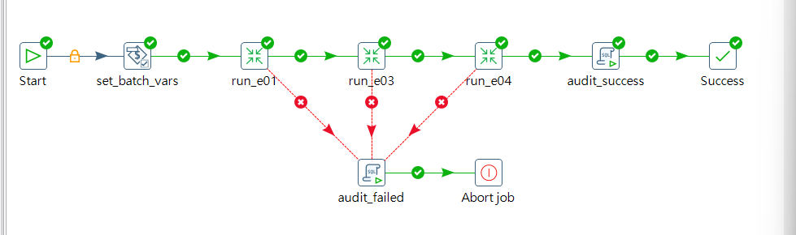
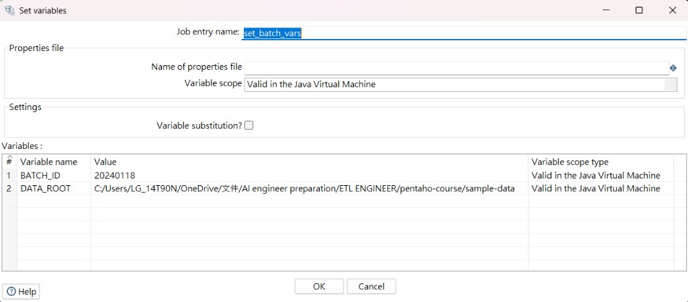
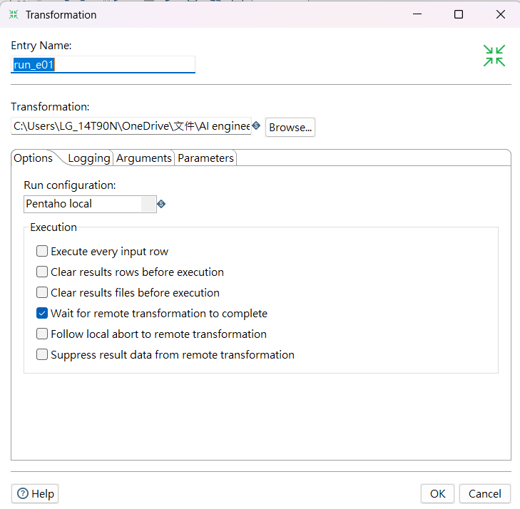
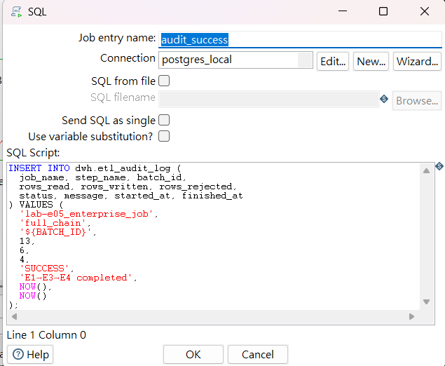
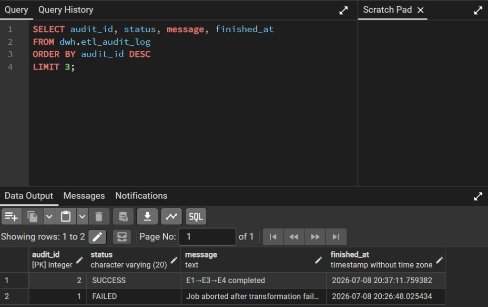

# Pentaho ETL — 企業夜間 Job（E1→E3→E4 + Audit）

Pentaho Data Integration（PDI）**Job** 編排：以參數化批次串接品質閘門、STG/ODS、SCD2，成功寫入 `dwh.etl_audit_log`；任一步失敗則寫 FAILED 並 Abort，避免半套髒資料進倉。

**技術棧：** Pentaho Spoon 9.3 CE · Java 11 · PostgreSQL 16 · Kitchen / Job

---

## 流程結果

| 段 | 步驟 | 結果 |
|----|------|------|
| 變數 | `set_batch_vars` | `BATCH_ID=20240118` |
| E1 | `run_e01` | Append 13 → rejected **4** / 合格去重 **6** |
| E3 | `run_e03` | STG / ODS Upsert **6** |
| E4 | `run_e04` | SCD2（已處理狀態下 changed/new 可為 **0**，冪等） |
| 成功路徑 | `audit_success` → Success | `etl_audit_log` **SUCCESS** |
| 失敗路徑（驗證過） | Failure → `audit_failed` → Abort | `etl_audit_log` **FAILED** |

---

## 資料流（Job 編排）



### Job 畫布（Spoon）



### Set variables — `BATCH_ID` / `DATA_ROOT`



### Transformation entry — `run_e01`（其餘 run_e03 / run_e04 同型）



### audit_success — 寫入 `dwh.etl_audit_log`



### pgAdmin — audit SUCCESS + FAILED



---

## 執行 Log（成功全鏈，2026/07/08）

```
run_e01           Append 13 → rejected 4 / dedupe W=6
run_e03           write_stg W=6 / write_ods W=6
run_e04           filter_changed W=0 / filter_new W=0   ← SCD 已合規，冪等
audit_success     result=[true]
Success           result=[true]
Finished job entry [run_e04] (result=[true])
Finished job entry [run_e03] (result=[true])
Finished job entry [run_e01] (result=[true])
Job execution finished
```

**解讀：** Job 依序跑完三支 transformation；E4 當次無變更列屬正常重跑。稍早失敗驗證寫入 `audit_id=1`（FAILED），本輪寫入 `audit_id=2`（SUCCESS）。

---

## 目錄結構

```
e5-enterprise-job/
├── README.md
├── artifacts/lab-e05_enterprise_job.kjb
└── screenshots/
    ├── 01-workflow.png
    ├── 02-set-variables.png
    ├── 03-run-e01.png
    ├── 04-audit-success-sql.png
    └── 05-audit-log.png
```

相依 transformation（本機 / 各 lab portfolio）：

- `lab-e01_data_quality.ktr`
- `lab-e03_stg_to_ods.ktr`
- `lab-e04_scd2_customer.ktr`

---

## 技術重點

### Job vs Transformation

| | Transformation `.ktr` | Job `.kjb` |
|--|----------------------|------------|
| 職責 | 處理資料列 | 編排順序、變數、錯誤分支 |
| 本 Lab | E1 / E3 / E4 | `lab-e05_enterprise_job.kjb` |

### Failure 路徑（atomic batch）

- 綠線（`evaluation=Y`）：上一步成功才往下
- 紅線（`evaluation=N`）：失敗 → `audit_failed` → **Abort job**
- 不採用「部分成功繼續寫 DWH」

### Audit SQL（成功）

```sql
INSERT INTO dwh.etl_audit_log (
  job_name, step_name, batch_id,
  rows_read, rows_written, rows_rejected,
  status, message, started_at, finished_at
) VALUES (
  'lab-e05_enterprise_job', 'full_chain', '${BATCH_ID}',
  13, 6, 4, 'SUCCESS', 'E1→E3→E4 completed', NOW(), NOW()
);
```

### 驗收 SQL

```sql
SELECT audit_id, job_name, batch_id, status, message, finished_at
FROM dwh.etl_audit_log
ORDER BY audit_id DESC
LIMIT 5;
```

| 預期 | 說明 |
|------|------|
| 至少 1 筆 SUCCESS | 全鏈成功 |
| 可有 1 筆 FAILED | 證明 Abort / 稽核路徑（選驗證） |

### 排程（說明即可）

Windows 工作排程器或 Cron 呼叫：

```text
Kitchen.bat /file:"...\lab-e05_enterprise_job.kjb" /level:Basic
```

（執行引擎仍是 Kettle；本作品集以 Spoon 本機驗證為主。）

### 實作注意

1. Job 內 Transformation 路徑請用**絕對路徑**（或 `${Internal.Job.Filename.Directory}`）
2. E4 的 `write_seed` hop 應維持 **Disabled**，避免夜間重灌 seed
3. E1 髒資料欄位（如 `age`、`postal_code`）讀檔時用 **String**，避免轉型殺批
4. SCD 已合規時重跑 E4 可出現 **W=0**，屬冪等，Job 仍可 SUCCESS

---

## 本機執行

1. PostgreSQL 已建 `dwh.etl_audit_log`（見 `setup_postgresql.sql`）
2. 用 **Java 11** 啟動 Spoon（`Spoon-java11.bat`）
3. 開啟 `artifacts/lab-e05_enterprise_job.kjb`（必要時修正三支 `.ktr` 路徑與 `postgres_local`）
4. F9 → 全程綠 → 跑上方驗收 SQL

---

## 涵蓋技能

ETL · Job 編排 · Set variables · Failure / Abort · Audit log · 與 Airflow DAG 角色對照 · 企業夜間批次思維
