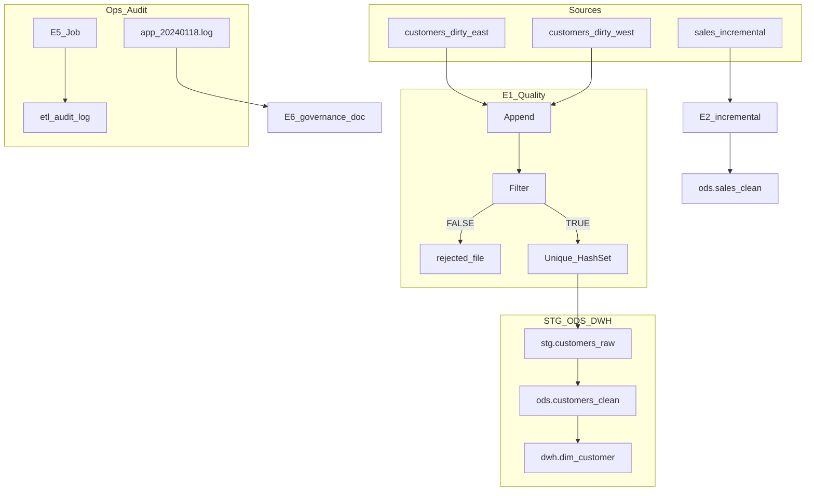

# Lab E6 — 血緣、PII 治理與稽核 FAQ

> **情境：** 土銀 IT 稽核來查——客戶姓名存在哪？誰能看？今日 rejected 幾筆？ETL 血緣？  
> **交付：** 稽核能看懂的文件（本檔）。不取代 OpenMetadata 產品，但對齊其 catalog / lineage / tag 思維。

**對應 JD：** 技術文件撰寫、OpenMetadata／資料治理、金融稽核問答  
**相依 Labs：** E1–E5（數字與路徑須一致）

---

## 1. 資料血緣圖（Lineage）

### 1.1 客戶主檔鏈（E1 → E3 → E4）

```
customers_dirty_east.csv  ──┐
customers_dirty_west.txt  ──┼→ E1 品質閘門
                            │     ├─ TRUE  → Unique → record_hash
                            │     │            ↓
                            │     │     stg.customers_raw
                            │     │            ↓
                            │     │     ods.customers_clean
                            │     │            ↓
                            │     │     dwh.dim_customer (SCD2)
                            │     │
                            │     └─ FALSE → output/rejected_customers_YYYYMMDD.txt
                            │
sales/incremental/*.csv  ───┼→ E2 → stg.sales_raw → ods.sales_clean → dwh.fact_sales
                            │
load/readings/*.csv ────────┘   E2b（選修）→ stg/ods load_readings
```

### 1.2 夜間 Job 與稽核（E5）

```
START → set_batch_vars (BATCH_ID)
      → run_e01 → run_e03 → run_e04
            │         │         │
            │ OK      │ OK      │ OK → audit_success → Success
            │         │         │         ↓
            │         │         │   dwh.etl_audit_log (SUCCESS)
            └─Fail────┴─Fail────┴─Fail → audit_failed → Abort
                                              ↓
                                    dwh.etl_audit_log (FAILED)
```

### 1.3 集中應用日誌（E6 範例）

```
app_20240118.log  →  稽核／運維查 ERROR、WARN、rejected_rows
                     （不必登入每台 ETL 主機翻檔）
```

### 1.4 Mermaid（簡圖）



---

## 2. 欄位治理表（Classification）

| 欄位 / 資產 | 分類 | 說明 | OpenMetadata 對應 |
|-------------|------|------|-------------------|
| `customer_name` | **PII** | 姓名；對外報表需遮罩（例：王○○） | Tag: `PII.Sensitive` |
| `customer_id` | 業務鍵 | 非 surrogate key；跨系統對帳用 | Glossary: Customer ID |
| `age` | 準 PII / 內部 | 品質規則驗證用；非公開欄 | Tag: `Internal` |
| `segment` | 業務屬性 | Consumer / Corporate；SCD2 追蹤變更 | Column description |
| `sales` / `amount` | 業務指標 | 對帳、報表 KPI | Metric / Glossary |
| `load_kw` | 業務指標 | 負載感測（E2b）；對帳用 | Metric |
| `device_id` | 設備識別 | 非自然人 PII；可關聯資產表 | Tag: `Asset.ID` |
| `record_hash` | 稽核指紋 | E1 MD5；變更偵測／對帳 | Technical metadata |
| `rejected_*.txt` | 稽核證據 | 不合格列去向；建議保留 ≥90 天 | Data product / path |
| `dwh.etl_audit_log` | 運維稽核 | read / written / rejected / status | Pipeline run metadata |

**金融落地順序（口述）：** 盤點資產 → Glossary → 掛 PII tag → 接 lineage → 再開放自助搜尋。

---

## 3. 稽核 FAQ（自答 ≥5，數字與 E1–E5 一致）

| # | 稽核問題 | 標準答法 |
|---|----------|----------|
| 1 | 今日客戶主檔 rejected 幾筆？存在哪？ | **4** 筆；`output/rejected_customers_YYYYMMDD.txt`（空 ID×2、C999 負年齡、C010 age=abc） |
| 2 | 今日讀入／合格寫入各多少？ | read=**13**（east 7 + west 6）；品質後 9；去重後 written=**6** |
| 3 | C001 的 segment 歷史怎查？ | `SELECT * FROM dwh.dim_customer WHERE customer_id='C001' ORDER BY effective_from` → 舊 Consumer 關閉（`is_current=N`）+ 新 Corporate（`is_current=Y`） |
| 4 | 同一份 incremental 銷售檔重跑會重複嗎？ | 不會；ODS 以 business key 擋重複（冪等）。第二次 `rows_written` 可為 0，audit 可佐證 |
| 5 | `customer_name` 是 PII 嗎？誰能看？ | 是。正式環境依 RBAC；對外／非正式環境遮罩或假資料，禁止直接 copy production |
| 6 | ETL 失敗怎麼查？ | `dwh.etl_audit_log`（status=FAILED）或集中 log `app_20240118.log` 的 ERROR 行；E5 失敗路徑會 Abort，避免半套進倉 |
| 7 | 血緣上 rejected 算「消失」嗎？ | 不算。每一列去向：ODS／DWH、rejected 檔、或 audit——三選一必須可交代 |

---

## 4. 日誌練習（`sample-data/app_20240118.log`）

Pipe 分隔：`timestamp|level|service|message`

| 指標 | 預期 | 本檔驗收 |
|------|------|----------|
| 總行數 | 10 | 10 |
| **ERROR** | **2** | 行 4（auth 401）、行 8（stg_to_ods connection_timeout） |
| **WARN** | **2** | 行 3（rejected_rows=2）、行 7（rate_limit 429） |
| INFO | 6 | 其餘 |

**為什麼要集中日誌：** 稽核／值班不用登每台機器找檔；可與 `etl_audit_log` 交叉驗證（例如 WARN 的 `rejected_rows` 與 E1 rejected 檔）。

**Spoon 加分練習（可選）：** Text file input，Separator=`|`，Filter `level = ERROR` → Preview 應 **2** 列。

---

## 5. OpenMetadata 與 ETL 分工

| | ETL（Pentaho PDI / Job） | OpenMetadata（Catalog） |
|--|-------------------------|-------------------------|
| 職責 | 抽轉載、品質閘門、冪等、SCD、失敗 Abort | 資產可發現、血緣、PII tag、Glossary、RBAC |
| 本作品集 | E1–E5 實作 | E6 文件對齊其思維；產品可用 Docker 另練 |

**一句話：** OpenMetadata **不是** 取代 ETL，是讓資產可發現、可治理；ETL 負責把資料做對，Catalog 負責讓人找得到、說得清、管得住。

**面試 30 秒：**

> OpenMetadata 是資料目錄與治理平台，用 connector 掃 DB／ETL／BI 建 schema 與血緣。金融場景我會先分類分級與 RBAC，敏感欄位脫敏，並保留稽核。我用 E1–E5 管線交出 rejected／audit／SCD2 證據，再用本文件標 PII 與血緣——對上 catalog 思維；正式部署可用 Docker 做本地驗證。

---

## 6. SI 交付物 checklist

- [x] 血緣圖（覆蓋 E1→E3→E4，並標 E2／E5／rejected）
- [x] 欄位治理表（≥5 欄，含 PII）
- [x] 稽核 FAQ（≥5 題，數字與 Lab 一致）
- [x] 日誌驗收（ERROR=2、WARN=2）
- [x] OpenMetadata ↔ ETL 分工說明

---

## 相關路徑

| 項目 | 路徑 |
|------|------|
| 本交付 | `artifacts/lab-e06_lineage_audit.md` |
| 範例 log | `sample-data/app_20240118.log` |
| 課程同檔 | `ETL ENGINEER/pentaho-course/sample-data/logs/app/app_20240118.log` |
| OM 口述筆記 | `ETL ENGINEER/08-openmetadata-notes.md` |
| 企業 Lab 規格 | `ETL ENGINEER/pentaho-course/03-lab-enterprise-challenges.md`（Lab E6） |
